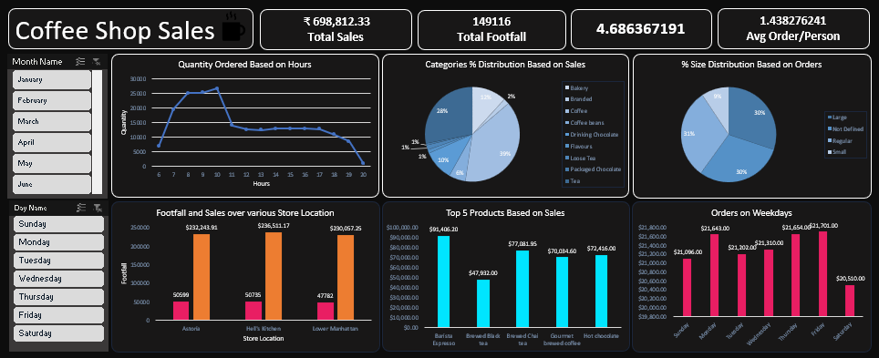

# Coffee Sales & Retail Analytics Dashboard


## 🖥️ Dashboard Preview



An interactive, end-to-end **Retail Coffee Sales Analytics Dashboard** built in Microsoft Excel. This analytical tool transforms raw transaction records into strategic business insights, enabling retail managers, store leads, and business analysts to track revenue performance, customer purchasing habits, store location footfall, product category distribution, and peak operational hours.

---

## 📌 Executive Summary

The **Coffee Sales Analysis Dashboard** analyzes **149,116 customer transaction records** collected across multiple store branches (Astoria, Lower Manhattan, and Hell's Kitchen) over a 6-month period (January through June). 

The dashboard bridges raw operational data with executive decision-making, offering dynamic filtering across timeframe dimensions (Month, Day of Week) to instantly update performance visualizers and key metric summaries.

---

## 📊 Dashboard Architecture & Layout

The workbook is structured into three dedicated layers following best practices in financial and operational data modeling:

```
Coffee Sales Analysis.xlsx
├── 📄 Sheet1     ─── [Data Layer]       Raw Transactional Records (149,117 rows × 16 fields)
├── ⚙️ Pivot      ─── [Aggregation Layer] 12 Data Pivot Tables & KPI Calculations
└── 📈 Dashboard  ─── [Visual Layer]      Interactive Dashboard with 6 Charts & Slicers
```

### 1. Visual Layer (`Dashboard` Sheet)
The executive view containing visual elements, KPI metrics, dynamic chart components, and interactive filters.

### 2. Aggregation Layer (`Pivot` Sheet)
A structured backend sheet housing 12 interconnected Pivot Tables (`PivotTable1` through `PivotTable15`) that drive the chart widgets and summary numbers without cluttering the user interface.

### 3. Data Layer (`Sheet1` Sheet)
The core transactional database containing raw records along with custom feature-engineered columns for time and temporal analysis.

---

## 📉 Visualizations & Chart Breakdown

The main `Dashboard` tab highlights **6 primary interactive charts**, each providing targeted business intelligence:

| # | Visualization Title | Chart Type | Business Value / Insight Focus |
|---|---|---|---|
| 1 | **Quantity Ordered Based on Hours** | Line / Area Chart | Identifies peak operational hours, rush periods, and staffing requirement needs throughout the operating day. |
| 2 | **Categories % Distribution Based on Sales** | Donut / Pie Chart | Displays revenue share across core categories (Coffee, Tea, Bakery, Drinking Chocolate, etc.). |
| 3 | **Footfall and Sales over Various Store Locations** | Clustered Column Chart | Compares store branch performance across locations (*Astoria*, *Lower Manhattan*, *Hell's Kitchen*). |
| 4 | **Top 5 Products Based on Sales** | Horizontal Bar Chart | Ranks the highest revenue-generating individual menu items to optimize inventory and marketing. |
| 5 | **% Size Distribution Based on Orders** | Donut / Bar Chart | Illustrates customer size preferences (*Small*, *Regular*, *Large*) to optimize packaging and pricing strategy. |
| 6 | **Orders on Weekdays** | Column / Bar Chart | Analyzes transaction volume differences across days of the week (*Monday* to *Sunday*). |

---

## 🎛️ Interactive Filters & Slicers

The dashboard features cross-connected Excel **Slicers** that allow users to slice and dice the entire report dynamically:

* **📅 Month Slicer (`Slicer_Month_Name`)**: Filter metrics by specific month (*January*, *February*, *March*, *April*, *May*, *June*) or select multiple months for comparative trends.
* **📆 Day Slicer (`Slicer_Day_Name`)**: Filter by specific days of the week (*Monday* through *Sunday*) to isolate weekday vs. weekend customer behavior.

---

## 📖 Data Dictionary (`Sheet1`)

The dataset comprises **149,116 rows** and **16 fields**:

| Column Name | Data Type | Description | Sample Values |
|---|---|---|---|
| `transaction_id` | Integer | Unique identifier for each retail transaction | `1`, `2`, `149116` |
| `transaction_date` | Date | Date when the purchase occurred | `2023-01-01`, `2023-06-30` |
| `transaction_time` | Time | Time stamp of the order | `07:06:11`, `18:32:00` |
| `transaction_qty` | Integer | Quantity of items purchased in the line item | `1`, `2`, `4` |
| `store_id` | Integer | Numeric store branch identifier | `3`, `5`, `8` |
| `store_location` | Text | Name of the retail store location | `Astoria`, `Lower Manhattan`, `Hell's Kitchen` |
| `product_id` | Integer | Unique product code | `22`, `45`, `87` |
| `unit_price` | Currency | Unit retail price per product ($) | `2.50`, `3.00`, `4.75` |
| `product_category` | Text | High-level product group | `Coffee`, `Tea`, `Bakery`, `Drinking Chocolate` |
| `product_type` | Text | Specific product classification | `Brewed herbal tea`, `Gourmet brewed coffee`, `Espresso` |
| `product_detail` | Text | Detailed item variant description | `Peppermint`, `Earl Grey`, `Lemon Grass` |
| `size` | Text | Item size specification | `Small`, `Regular`, `Large`, `Not Defined` |
| `Total_bill` | Currency | Total sale value (`transaction_qty` × `unit_price`) | `$2.50`, `$9.50` |
| `Month Name` | Text | Feature-engineered month name | `January`, `February`, `March` ... |
| `Day Name` | Text | Feature-engineered day of week | `Monday`, `Tuesday`, `Wednesday` ... |
| `Hour` | Integer | Feature-engineered hour of day (0-23) | `7`, `8`, `12`, `17` |

---

## 🔍 Strategic Business Insights Enabled

1. **Staffing & Shift Optimization**: Peak ordering hours reveal prime morning rush times, enabling store managers to align barista schedules with customer traffic.
2. **Location Performance Benchmark**: Direct comparison between *Astoria*, *Lower Manhattan*, and *Hell's Kitchen* highlights top-performing branches and growth opportunities.
3. **Menu & Product Mix**: Clear breakdown of Top 5 products and low-performing categories guides menu development, stock ordering, and promotional bundling.
4. **Volume & Size Strategy**: Understanding size selection percentages helps optimize cup/packaging inventory management and upsell strategies.

---

## 🚀 How to Use the Dashboard

1. **Open File**: Open `Coffee Sales Analysis.xlsx` in **Microsoft Excel 2016** or newer (or Excel for Microsoft 365).
2. **Navigate to Dashboard**: Select the `Dashboard` tab at the bottom of the workbook.
3. **Apply Filters**: Click on any Month or Day in the **Slicers** on the side of the dashboard to filter all 6 charts instantly.
4. **Multi-Select**: Hold `Ctrl` while clicking slicer buttons to select multiple months or days.
5. **Clear Filters**: Click the filter icon with a red `X` in the top-right corner of a slicer to clear selection and view all data.
6. **Data Refresh**: If updating data in `Sheet1`, go to the **Data** tab in the Excel ribbon and click **Refresh All** to update all Pivot Tables and Dashboard charts.

---

## 💻 Technical & System Requirements

* **File Format**: Microsoft Excel OpenXML Spreadsheet (`.xlsx`)
* **Software**: Microsoft Excel 2016, 2019, 2021, Office 365, or Excel for Web.
* **Dependencies**: No external macros (VBA) or external database connections required; fully self-contained spreadsheet model.
